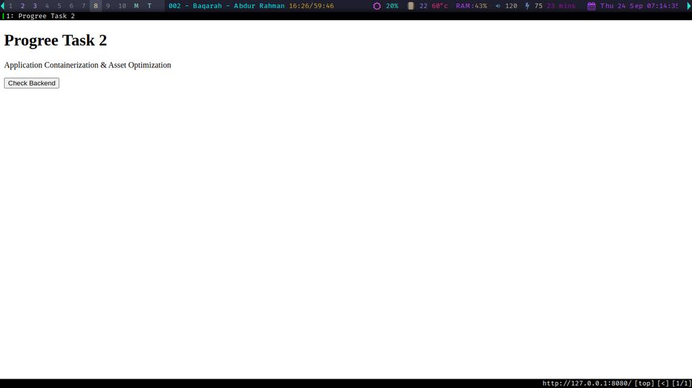
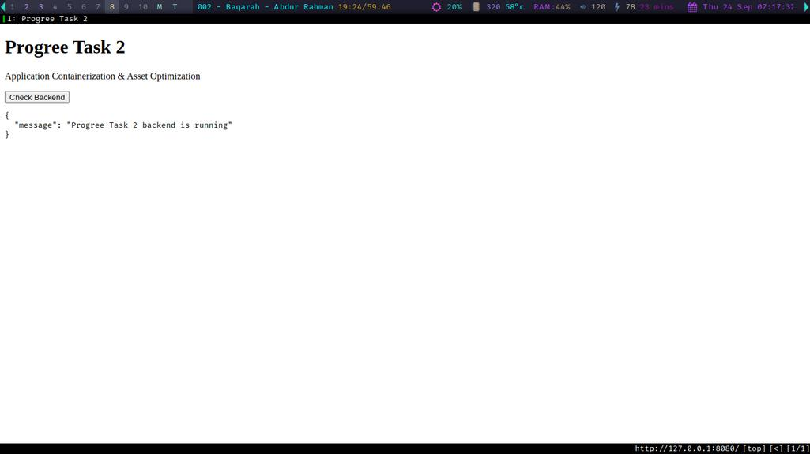
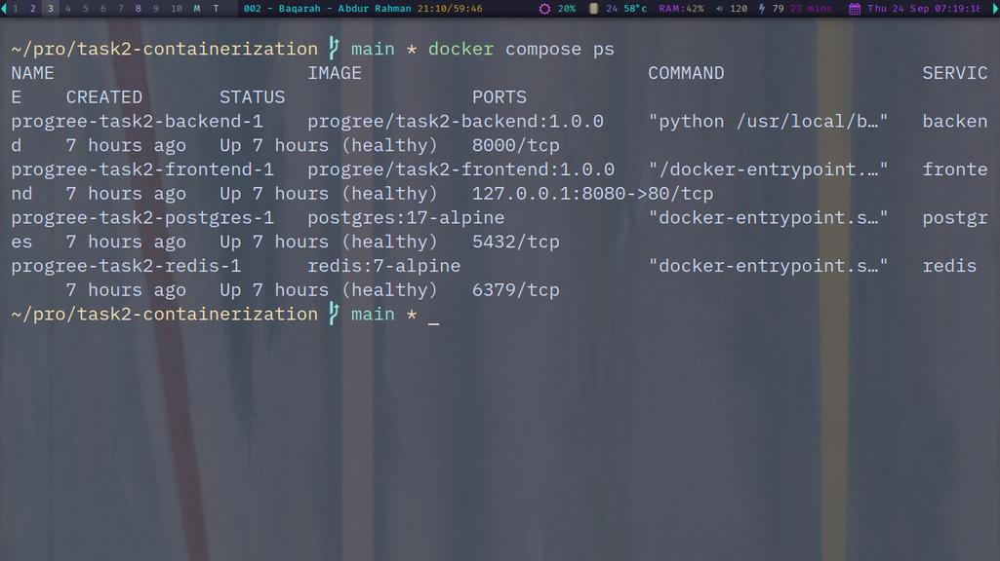
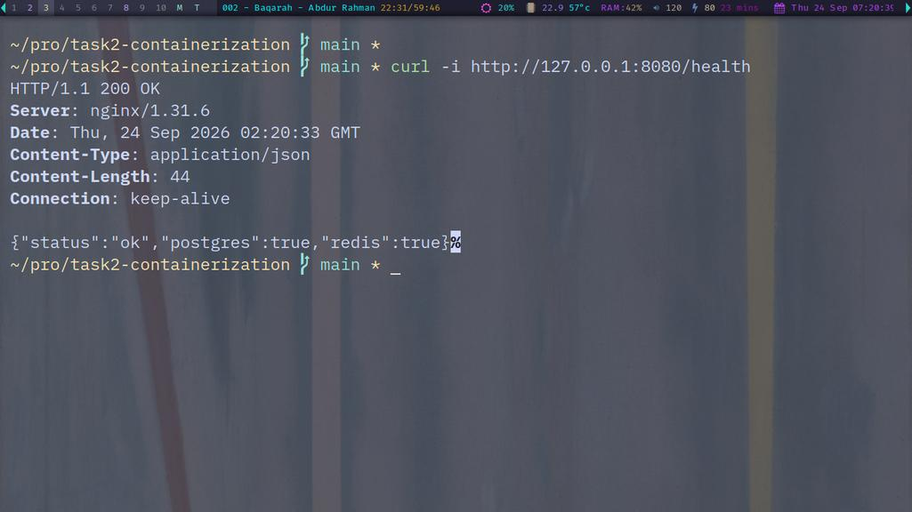
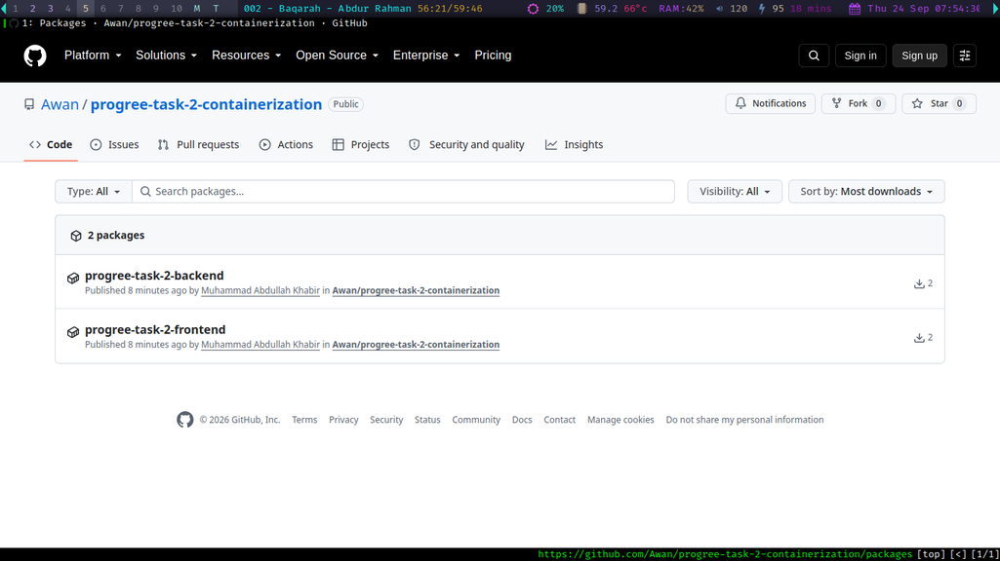

# Progree Internship — Task 2: Application Containerization & Asset Optimization

[](https://github.com/Awan/progree-task-2-containerization/actions/workflows/publish-images.yml)

A modular, multi-container web application environment built for the Progree internship Task 2 assessment.

## Objective

Build a modular and reliable application container environment demonstrating:

* Multi-stage Docker builds
* Multi-dependency application runtime
* Reduced final image footprints
* Production frontend asset generation and optimization
* Secure environment and secret configuration
* Functional container networking and port routing
* Health checks and service dependency management
* Automated container image publishing with GitHub Actions and GHCR

## Architecture

```text
                         Host
                          │
                   127.0.0.1:8080
                          │
                          ▼
                    ┌───────────┐
                    │   Nginx   │
                    │  Frontend │
                    └─────┬─────┘
                          │
                     app network
                       (internal)
                          │
                          ▼
                    ┌───────────┐
                    │  FastAPI  │
                    │  Backend  │
                    └─────┬─────┘
                          │
                    backend network
                       (internal)
                     ┌────┴────┐
                     ▼         ▼
                PostgreSQL   Redis
```

The frontend is the only service published to the host.

| Service         | Container Port |        Host Port | Purpose                        |
| --------------- | -------------: | ---------------: | ------------------------------ |
| Nginx frontend  |             80 | `127.0.0.1:8080` | Application entry point        |
| FastAPI backend |           8000 |    Not published | Application API                |
| PostgreSQL      |           5432 |    Not published | Persistent relational database |
| Redis           |           6379 |    Not published | Application data/cache service |

## Screenshots

### Progree Application



### Frontend to Backend Integration



### Complete Container Stack



### End-to-End Health Check



### GitHub Container Registry



The published images were verified by pulling the `latest` tags directly from GitHub Container Registry (GHCR):

```text
ghcr.io/awan/progree-task-2-backend:latest
ghcr.io/awan/progree-task-2-frontend:latest
```

Both images were successfully pulled from GHCR, confirming that the GitHub Actions workflow built and published the application images successfully.

For reproducible deployments, immutable image digests or version-specific image tags can be used instead of the mutable `latest` tag.


## Technology Stack

* Docker
* Docker Compose
* Python 3.12
* FastAPI
* Uvicorn
* PostgreSQL 17
* Redis 7
* Node.js 22
* Vite
* Nginx Alpine
* Docker secrets
* GitHub Actions
* GitHub Container Registry (GHCR)
* OCI image metadata

## Project Structure

```text
progree-task-2-containerization/
├── .github/
│   └── workflows/
│       └── publish-images.yml
├── backend/
│   ├── app/
│   │   └── main.py
│   ├── docker-entrypoint.py
│   ├── Dockerfile
│   ├── .dockerignore
│   └── requirements.txt
├── frontend/
│   ├── src/
│   │   └── main.js
│   ├── Dockerfile
│   ├── .dockerignore
│   ├── index.html
│   ├── nginx.conf
│   ├── package.json
│   └── package-lock.json
├── docs/
│   └── screenshots/
│       ├── 01-progree-app.jpg
│       ├── 02-progree-backend.jpg
│       ├── 03-progree-stack.jpg
│       └── 04-progree-health.jpg
├── secrets/
│   └── postgres_password.txt
├── docker-compose.yml
├── .gitignore
└── README.md
```

The PostgreSQL password file is intentionally excluded from Git by `.gitignore`.

## Multi-Stage Docker Builds

### Backend

The backend Dockerfile uses two stages:

1. `builder` installs the Python dependencies.
2. `runtime` contains the Python runtime, installed dependencies, and application code.

Build dependencies and temporary build content are kept out of the final runtime stage.

The backend runtime starts Uvicorn as the non-root `appuser` with UID `10001`.

### Frontend

The frontend Dockerfile uses two stages:

1. Node.js 22 Alpine builds the production frontend assets with Vite.
2. Nginx Alpine serves the generated static assets.

Only the generated `/app/dist` content is copied into the final runtime image. Node.js, npm, and frontend build dependencies are therefore excluded from the final runtime image.

`npm ci` is used together with `package-lock.json` for reproducible dependency installation.

## Secure Configuration

The PostgreSQL password is not stored directly in `docker-compose.yml`.

Docker Compose mounts the password as a secret:

```text
/run/secrets/postgres_password
```

The backend entrypoint initially runs with the privileges required to access the Docker secret. It copies the secret into an application-owned runtime location with restrictive permissions, then drops privileges and starts Uvicorn as `appuser` (UID `10001`).

The original host-side secret file remains local and is excluded from Git.

## Network Isolation

Three Docker networks are used:

```text
public
app
backend
```

### `public`

A normal Docker bridge network used by the Nginx frontend. It allows the published host port to reach the frontend container.

### `app`

An internal network shared by:

* Nginx frontend
* FastAPI backend

### `backend`

An internal network shared by:

* FastAPI backend
* PostgreSQL
* Redis

PostgreSQL and Redis are not published to the host.

FastAPI is also not published to the host. Nginx provides the external application entry point and routes API requests internally.

## Routing

The public application entry point is:

```text
http://127.0.0.1:8080
```

Nginx serves the frontend and routes API requests internally to the FastAPI service.

API endpoints:

```text
GET /api
GET /api/
```

are routed to:

```text
http://backend:8000/api
```

The health endpoint:

```text
GET /health
```

is routed to:

```text
http://backend:8000/health
```

The FastAPI health endpoint checks connectivity to both PostgreSQL and Redis.

## Health Checks

Docker Compose health checks are configured for:

* PostgreSQL
* Redis
* FastAPI
* Nginx

Startup dependencies use health conditions so that:

1. PostgreSQL becomes healthy.
2. Redis becomes healthy.
3. FastAPI starts after both dependencies are healthy.
4. Nginx starts after FastAPI becomes healthy.

## Image Metadata

The custom images contain OCI metadata identifying the project, author, source repository, and documentation.

Author:

```text
Muhammad Abdullah Khabir <abdullah@abdullah.support>
```

The image metadata is configured to point to this GitHub repository:

```text
https://github.com/Awan/progree-task-2-containerization
```

## GitHub Container Registry

The project includes a GitHub Actions workflow that builds and publishes the two custom application images to GitHub Container Registry (GHCR).

### Backend Image

```text
ghcr.io/awan/progree-task-2-backend
```

### Frontend Image

```text
ghcr.io/awan/progree-task-2-frontend
```

The publishing workflow is located at:

```text
.github/workflows/publish-images.yml
```

The workflow:

1. Checks out the repository.
2. Authenticates to GHCR using the repository-provided `GITHUB_TOKEN`.
3. Builds the backend image from `backend/Dockerfile`.
4. Builds the frontend image from `frontend/Dockerfile`.
5. Publishes both images to GHCR.
6. Generates image tags based on the branch, commit SHA, and version tags.

The workflow is triggered by pushes to the `main` branch, version tags, and manual workflow dispatch.

## Running the Project

### Create the Local Secret

Generate the PostgreSQL password used by the local Compose environment:

```bash
mkdir -p secrets && openssl rand -base64 32 | tr -d '\n' > secrets/postgres_password.txt && chmod 600 secrets/postgres_password.txt
```

### Build and Start the Complete Environment

```bash
docker compose up -d --build
```

### Check Service Health

```bash
docker compose ps
```

### Open the Application

```text
http://127.0.0.1:8080
```

## Verification

### Frontend

```bash
curl http://127.0.0.1:8080
```

### API

```bash
curl http://127.0.0.1:8080/api
```

### API with Trailing Slash

```bash
curl http://127.0.0.1:8080/api/
```

### End-to-End Health

```bash
curl http://127.0.0.1:8080/health
```

Expected response:

```json
{
  "status": "ok",
  "postgres": true,
  "redis": true
}
```

This verifies the complete path:

```text
Host
  │
  ▼
Nginx
  │
  ▼
FastAPI
 ┌┴─────────────┐
 ▼              ▼
PostgreSQL     Redis
```

## Assessment Requirement Mapping

| Requirement                           | Implementation                                            |
| ------------------------------------- | --------------------------------------------------------- |
| Multi-stage configuration Dockerfiles | Separate builder/runtime stages for backend and frontend  |
| Multi-dependency web runtime          | FastAPI + PostgreSQL + Redis                              |
| Minimized final image footprint       | Build dependencies excluded from runtime stages           |
| Asset optimization                    | Vite production build + Nginx static asset serving        |
| Secure environment configuration      | Docker secret for PostgreSQL password                     |
| Functional container port routing     | `127.0.0.1:8080` → Nginx → FastAPI                        |
| Service isolation                     | Internal Docker networks for application/backend services |
| Reliable startup                      | Health checks and dependency conditions                   |
| Persistent application data           | Named PostgreSQL and Redis volumes                        |
| Secure runtime                        | FastAPI application runs as non-root UID `10001`          |
| Container image publishing            | GitHub Actions → GitHub Container Registry                |

## Image Footprints

Verified image sizes:

```text
Backend:  approximately 186.2 MB
Frontend: approximately 62.9 MB
```

The frontend runtime image contains Nginx and the generated production assets, while the Node.js build environment remains in the builder stage.

The backend uses a separate builder stage so dependency installation does not require build-related content to remain in the final runtime stage.

## Author

**Muhammad Abdullah Khabir**

GitHub:

https://github.com/Awan

Repository:

https://github.com/Awan/progree-task-2-containerization
